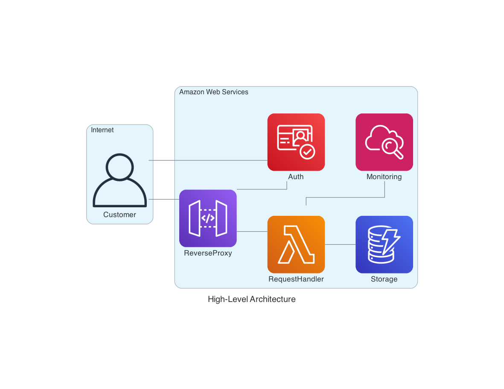
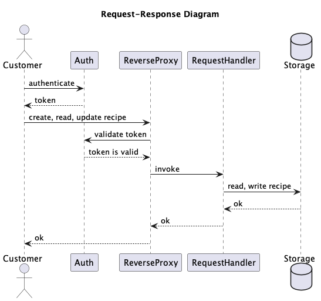

# Design

## Problem

~~Coding~~ Cooking Challenge for Fresco.

### Goal

Deploy a REST API that can manage recipes.

### Requirements

1.  [x] Support to create, retrieve and modify a recipe.
1.  [ ] Optional: Add some kind of authentication (e.g. token).
1.  [ ] Optional: Create a lightweight client to query the API.
1.  [x] Optional: Provide a containerized solution (e.g. Dockerfile).
1.  [x] Deliver a diagram and explanation of how to deploy and run the solution in the AWS.

### Constraints

1. Programming Languages: Python or Go are recommended.
1. You can choose what Schema definitions and data structures to use.
1. You can choose any storage/persistence that you consider.
1. Standard specifications (e.g. OpenAPI) are optional but encouraged.
1. A recipe has a list of ingredients and ingredients have quantities (e.g. 50 gr of Olive Oil).
1. A recipe has steps to follow.

### Evaluation Criteria

1. the code is working.
1. code quality.
1. scalability of the solution.

## Solution

### Architecture

### Components

-   **Auth (Cognito):** This component is responsible for authenticating and authorizing customers.  
    The customer and the ReverseProxy communicate with this component to fetch and validate credentials (e.g.: token).
-   **ReverseProxy (Api Gateway):** This component is responsible for accepting incoming requests to  
    create, update and list recipes from customers. It validates credentials (e.g.: tokens), send  
    events downstream to the RequestHandler and send the response from RequestHandler back to the customer.
-   **RequestHandler (Lambda):** This component is responsible for processing events sent by the  
    ReverseProxy. It reads and writes recipes from/to the Storage. It also publishes logs and
    metrics to the Monitoring component.
-   **Storage (DynamoDB):** This component is responsible for storing recipes. RequestHandler  
    reads and writes recipes in here.
-   **Monitoring (CloudWatch):** This component is responsible for storing logs and metrics,  
    providing an interface to create alarms and dashboards. On every request, RequestHandler  
    publishes service logs and metrics, which are used in monitors and dashboards. An operational  
    dashboard is created during deployment-time with key metrics and logs, plus monitors to track  
    availability and latency.

### Request-Response

Below is a sequence flow to get a recipe by id:  

### Packages

I've created a single github repository (`gota`) with two packages: `gota-core` and `gota-cdk`.  
Ideally, I'd create one repo for `gota-core` and another one for `gota-cdk`. The CDK package contains  
infrastructure as code and the Core package contains the business logic for the API.

### Programming language

The CDK package is in TypeScript because I've never written CDK with Python before - I could,  
but given this is for an interview, I'm optimizing for coding speed. I've chosen Python for the  
Core package because I'm faster writing Python code and the performance isn't a concern, as per  
requirements. If it was, I'd have chosen Go AFTER running performance tests against the API with  
both Python and Go - maybe Python would be fast enough.

### Frameworks

The API is powered by [FastAPI](https://github.com/tiangolo/fastapi). It supports OpenAPI and  
can generate clients from the specification. Lastly, it supports many authentication mechanisms, such as JTW.  
[Uvicorn](https://www.uvicorn.org/) is used to spin up a standalone web server (quite useful in tests).  
To integrate with AWS, I'm using [Mangum](https://mangum.io/asgi-frameworks/) adapter.

`sam` is used to spin up a docker container with resources defined in CDK, such as Lambda and API Gateway.

### Tests

I've added some unit tests to the Core package, but didn't add any to CDK to save time. In a real project,  
I would. Once I got the project working, I wrote integration tests and relied on them to catch  
bugs - besides the existing unit tests I'd already implemented.

#### Unit

Present in the Core package. Doesn't exist in the CDK package for reasons outlined above.

#### Integration

The tests themselves are present in the Core package. They send HTTP requests to a local API.  
There are two ways to deploy the API locally: as a standalone ASGI web server or as a local aws  
stack - which represents, to some extend, what is deployed to aws.

Testing against a standalone web server allows to detect issues in the Core package. If tests pass,  
we can go ahead and run the tests against an aws stack. If tests fail, we know it's an issue with  
aws resources, not with the Core package.

To run integration tests for on a standalone web server, check `Deployment modes > Local ASGI Web Server`  
in the Core package. To run integration tests on an aws stack, check `Deploy -> Local -> Build & Run`  
in the CDK package.

## Roadmap

The list below provides an overview of what I think is the bare minimum to deploy this project
to production. The items here were not implemented, some of them are from requirements (as optional).

-   Functionality
    -   Add support to query recipes by fields other than id.
    -   Add thumbnails to recipes.
    -   Create a lightweight client to query the API.
    -   Add custom validation to models, such as min, max, etc.
    -   Expose OpenAPI specification in API Gateway.
-   Development
    -   Create a CI/CD pipeline.
        -   [Test] Add performance tests and run them as part of the pipeline.
        -   [Test] Add smoke tests and run them as part of the pipeline.
        -   [CodeQuality] Add git integration to run various code quality checks for cdk and python.
        -   [CodeQuality] Add code coverage integration.
    -   Add [always up] canaries to produce traffic and help measure service health.
    -   Resolve "TODO" comments in the CDK and Core packages.
-   Operations
    -   Add service health monitors (availability and latency) and alarm on breach of SLA.
    -   Publish business and service metrics/logs to metrics/logs storage.
    -   Add business and operational dashboards.
    -   Add service-impairent runbooks to help troubleshoot, find root causes and mitigate them.
-   Security
    -   Add some kind of authentication (e.g. token).
    -   Run a thread model to capture security vulnerabilities.
